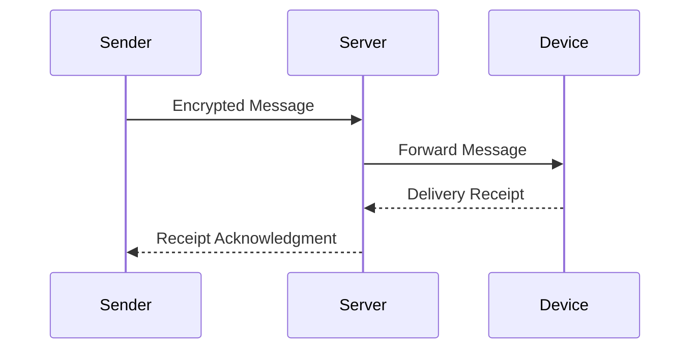

# Silent Delivery Receipts

## What Is a Delivery Receipt?

A **delivery receipt** is an acknowledgment that a message has reached at least one
recipient device.

Unlike read receipts:
- They are **not user-visible**
- They are **not configurable**
- They are **automatically generated**

---

## What Makes Them “Silent”?

Silent Delivery Receipts (SDRs):
- Occur without user interaction
- Do not appear in the UI
- Are still transmitted over the network

The user is **unaware** they are being generated.

---

## Simplified Message Flow

The receipt exists **outside the encrypted message content**.

---

## Why SDRs Exist

SDRs support:

- Reliable message delivery
- Multi-device synchronization
- Offline message queues
- Network fault recovery

They are **functionally necessary**, which makes them difficult to remove.

---

## Security Implication

Even if the receipt contains no content:

- Its **existence**
- Its **timing**
- Its **frequency**

can all leak information.

This turns SDRs into a **metadata side-channel**.
