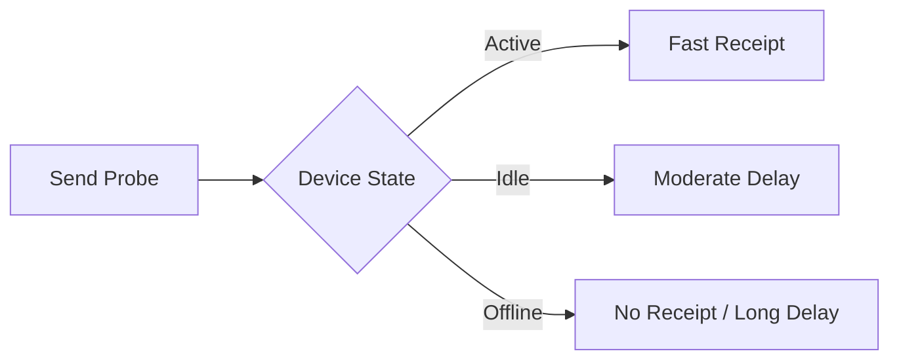

# Timing Side-Channels

## What Is a Timing Side-Channel?

A timing side-channel occurs when:
> The time taken to perform an operation reveals information about internal state.

No cryptography is broken.
Only **time measurements** are observed.

---

## Why Timing Matters for SDRs

Delivery receipts are:
- Automatically generated
- Dependent on device state
- Dependent on network conditions

Different states → different delays.

---

## Example Timing Model

---

## Observable Signals

An observer may distinguish:

- Online vs offline
- Active vs idle
- Wi-Fi vs cellular
- Single vs multiple devices

Each inference is **probabilistic**, not guaranteed.

---

## Why This Is Hard to Prevent

- Network latency is unavoidable
- Mobile OS scheduling varies
- Servers must confirm delivery

Even small timing differences can accumulate into patterns.

---

## Key Insight

> Encryption hides **what** you say  
Timing reveals **when** and **how** you behave