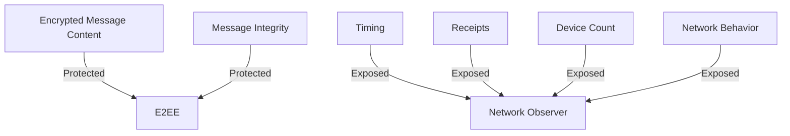

# Metadata vs Encryption

## What Encryption Protects

End-to-end encryption protects:
- Message content
- Attachments
- Message integrity

It does **not** fully protect metadata.

---

## What Metadata Includes

- Sender and recipient identifiers
- Message timestamps
- Delivery acknowledgments
- Device count
- Network behavior

---

## Metadata Flow Example

---

## Why Metadata Is Powerful

Metadata can reveal:

- Social graphs
- Daily routines
- Sleep/wake cycles
- Travel patterns

All **without reading a single message**.

---

## Common Misconception

> “If it’s encrypted, it’s private.”

Reality:

> Encryption is necessary, but **not sufficient** for privacy.

---

## Design Lesson

Privacy-preserving systems must consider:

- Metadata minimization
- Behavioral obfuscation
- Traffic analysis resistance