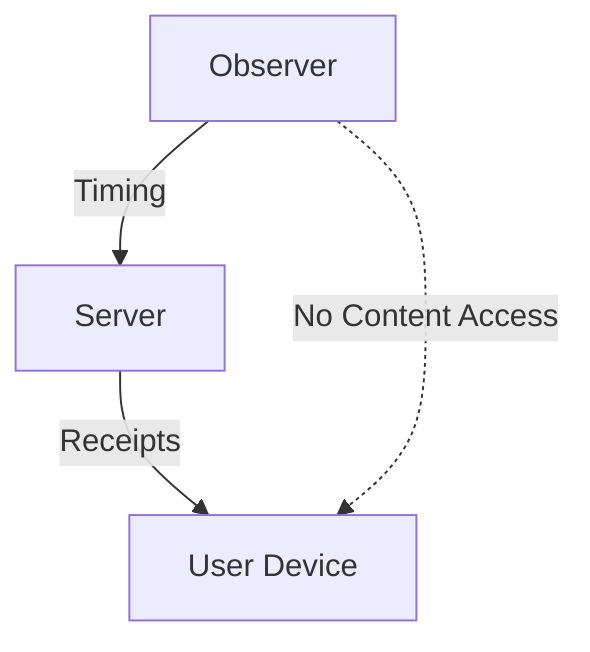

# Threat Models

## Why Threat Modeling Matters

Understanding *who* can observe SDRs helps define realistic risks
and appropriate defenses.

---

## In-Scope Threat Actors

### Passive Observers
- Can measure timing
- Cannot alter traffic
- Example: server-side observer

### Semi-Passive Probers (Simulated Only)
- Send messages
- Measure responses
- Do not access content

---

## Out-of-Scope Actors

This project explicitly excludes:
- Malware
- Device compromise
- Network MITM attacks
- Platform reverse engineering

---

## Threat Model Diagram

---

## What Can Be Inferred (Probabilistically)

- Device availability
- Network type
- Behavioral rhythms

### What cannot be inferred:

- Message content
- Contacts
- Message text
- Encryption keys

---

## Ethical Boundary

Any inference without consent is:

- Ethically questionable
- Potentially illegal
- Outside the scope of this project