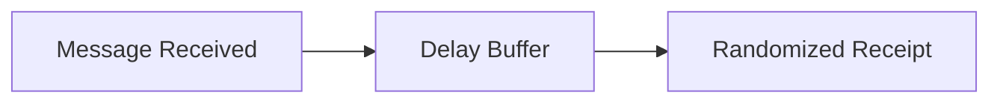

# Defensive Mitigations

## Design Philosophy

The goal is not to eliminate receipts,
but to **reduce information leakage**.

---

## Server-Side Mitigations

### Timing Obfuscation
- Randomized receipt delays
- Jitter injection

### Receipt Batching
- Aggregate acknowledgments
- Fixed transmission intervals

---

## Client-Side Mitigations

- Delay acknowledgments when idle
- Power-state-independent scheduling
- Uniform background behavior

---

## Protocol-Level Ideas

---

## Rate Limiting

- Limit receipt frequency
- Detect abnormal probing patterns
- Apply backoff mechanisms

---

## Privacy Trade-Offs

| Mitigation    | Cost                       |
| ------------- | -------------------------- |
| Delay         | Slower delivery feedback   |
| Batching      | Reduced real-time sync     |
| Randomization | Increased latency variance |

---

## Key Takeaway

> Perfect privacy is not free —   
but **thoughtful design dramatically reduces risk**.

---

## Final Note

This repository exists to:

- Educate
- Improve system design
- Encourage privacy-first thinking

> [!CAUTION]
> Not to enable misuse. 