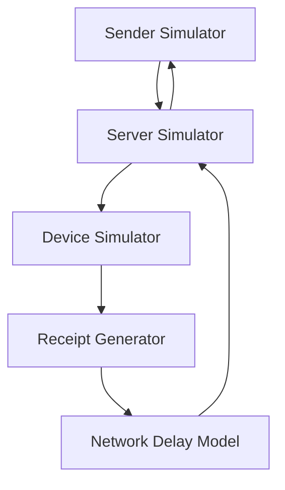
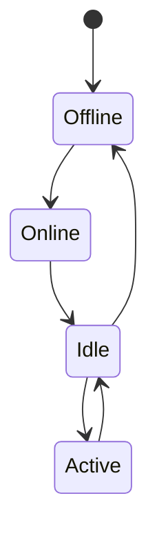
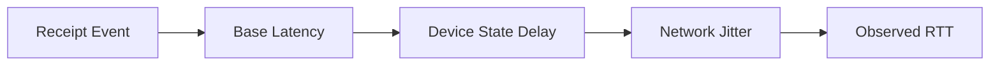

# Simulator Architecture

## Overview

The SDR Simulator models how **delivery receipts** are generated and how
their **timing varies** based on system state.

It is a **conceptual replica**, not a protocol implementation.

---

## High-Level Components

---

## Component Responsibilities

### 1. Sender Simulator

- Initiates message events
- Measures round-trip time (RTT)
- Logs timing data

**No real messages are sent.**

---

### 2. Server Simulator

- Routes messages
- Queues deliveries
- Applies batching or delay logic

Represents a **logical relay, not a real server.**

---

### 3. Device Simulator

Models device state such as:

- Online / Offline
- Active / Idle
- Single-device / Multi-device

State directly influences receipt timing.

---

### 4. Network Delay Model

Introduces:

- Latency
- Jitter
- Packet delay variation

Example modeled networks:

- Wi-Fi
- LTE / 5G
- Poor connectivity

---

### 5. Receipt Generator

Creates a **silent delivery receipt** when:

- Message reaches a simulated device
- No user interaction occurs

Receipt contains **no content, only timing**.

---

## Device State Model

Each state maps to a latency distribution.

---

## Timing Model (Conceptual)

---

## Why This Architecture Matters

This separation allows:

- Independent experimentation
- Clear attribution of timing effects
- Safer learning without real-world risk

---

## Explicit Non-Goals

The simulator does NOT:

- Implement encryption
- Mimic proprietary protocols
- Use real phone numbers
- Communicate externally

---

## Design Philosophy

> If timing alone can leak information in a simulator,   
it can leak in real systems — **that is the lesson**.
