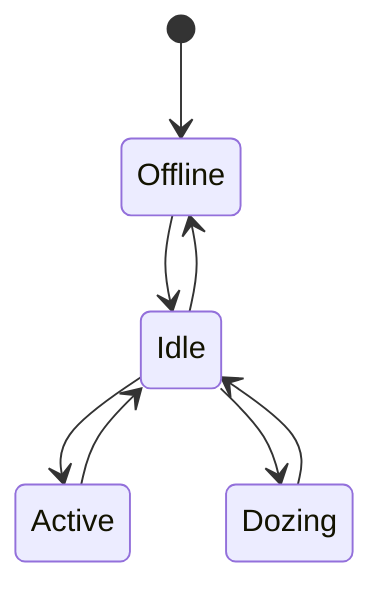

# Device State Model

## Purpose

This module models how a **recipient device’s internal state**
affects the timing of **silent delivery receipts (SDRs)**.

No user interface, messages, or real devices are involved.

---

## Why Device State Matters

Mobile devices do not respond uniformly at all times.

Factors include:
- CPU scheduling
- Power-saving modes
- App foreground/background state
- Network wake-up latency

These differences affect **when a receipt is generated**.

---

## Modeled Device States

| State | Description |
|-----|------------|
| Active | Screen on, app active |
| Idle | Screen off, app backgrounded |
| Dozing | Aggressive power saving |
| Offline | No network connectivity |

---

## State Transitions

---

## State-Dependent Delay

Each state adds a **processing delay** before a receipt can be generated.

| State   | Delay Profile  |
| ------- | -------------- |
| Active  | Minimal        |
| Idle    | Moderate       |
| Dozing  | High, variable |
| Offline | No receipt     |

---

## Delay Modeling Strategy

Delays are modeled using:

- Fixed base delay
- Small random variation
- Optional heavy-tail behavior

This reflects OS scheduling uncertainty.

---

## Key Insight

> Even without reading messages,   
device behavior leaves timing fingerprints.
