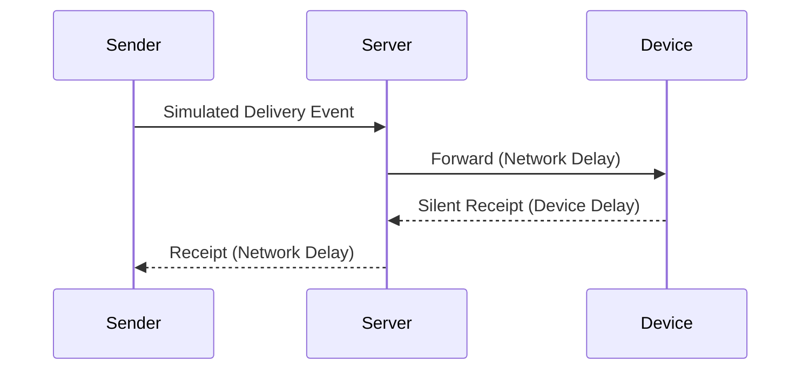

# Receipt Generator

## Purpose

This module generates a **Silent Delivery Receipt (SDR)** event
by combining:

- Device processing delay
- Network transmission delay
- Server relay timing

The output is a **simulated round-trip time (RTT)** measurement.

---

## What Is Being Simulated

We simulate:
- A sender triggering a delivery event
- A server relaying it
- A device generating a silent receipt
- The receipt returning to the sender

We do NOT simulate:
- Message content
- Encryption
- Real messaging protocols

---

## Receipt Lifecycle



---

## RTT Composition

RTT is calculated as:

```text
RTT =
    forward_network_delay
  + device_processing_delay
  + return_network_delay
```

If the device is offline:

- No receipt is generated
- RTT is undefined (None)

---

## Why RTT Matters

From the sender’s perspective:

- RTT is the **only observable signal**
- Internal states are hidden
- Inference relies entirely on timing

This mirrors real-world side-channel conditions.

---

## Important Constraint

The generator:

- Produces **one receipt per event**
- Has no looping or probing logic
- Does not automate observations

Inference is intentionally deferred to experiments.

---

## Key Insight

> A single RTT means little.   
Patterns over time are what create risk.
