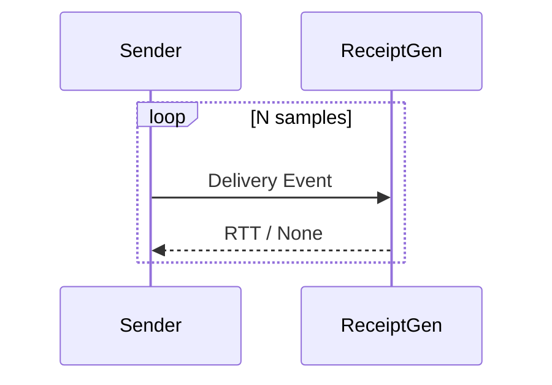

# Sender Simulator

## Purpose

The Sender Simulator represents the **observer’s viewpoint**:
it initiates simulated delivery events and records **RTT observations**.

It does not:
- Know device state
- Control the device
- Perform inference

It only **measures time**.

---

## Why This Matters

In real systems:
- Observers see only timing
- Internal states are hidden
- Inference is indirect

This simulator enforces that same limitation.

---

## Responsibilities

The Sender Simulator:
- Triggers delivery events
- Measures RTT returned by the Receipt Generator
- Logs results with timestamps
- Remains agnostic to internal causes

---

## Sampling Strategy

Sampling is:
- Explicit
- Bounded
- Manually configured

No continuous probing or aggressive loops are included by default.

---

## Data Collected

Each sample records:
- Sample index
- Timestamp
- Observed RTT (or None)

No identifiers, content, or metadata beyond timing.

---

## Conceptual Flow

---

## Ethical Guardrails

- No phone numbers
- No identifiers
- No external connections
- No hidden automation

All sampling is visible and intentional.
